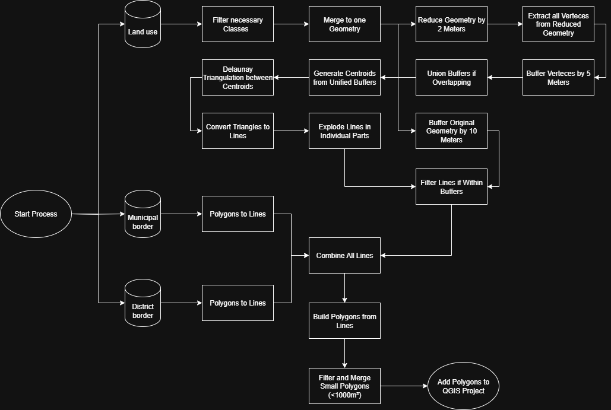

#  Building Block Creator Plugin

## Overview

The Building Block Creator Plugin is a QGIS extension that combines ALKIS data to semi-automatically create building plots. The plugin analyzes land use data and uses a complex geometric processing process to create contiguous building plots.  
Building blocks are an essential tool for modern municipal and regional statistics. They allow researchers to aggregate and store precise and critical data while complying with the GDPR while still keeping a small scale representation of space for statistical analyses.

## Background

This plugin is based on the [paper](https://github.com/tlehman1/Python_QGIS_ArcGIS_Uni_Muenster/blob/final_project/Final_Project/Literatur/2019-04-11-AbleitungVonBaubloecken_Kelm.pdf) "Semiautomatisches Verfahren zur Ableitung von Baublöcken" by Kelm et. al..
It describes the theoretical framework and can be implemented in many different ways.  
Since we wanted to focus on generating usable results while only relying on open data, the process is quite complex.
Additional example data for this process can be found [here](https://opendata.kreis-guetersloh.de/dataset/?tags=Planen+-+Bauen+-+Kataster).

## Features

- **Automated building block generation**: Creates building plots from infrastructure data
- **Filtering by land use types**: Takes specific land use types into account (road traffic, rail traffic, watercourses, paths)
- **Geometric processing**: 15-step processing process with Delaunay triangulation
- **PDF export**: Exports the result as a PDF with title and statistics
- **Progress bar**: Shows the processing progress in real time

## Installation

1. Copy the plugin directory to your QGIS plugin folder
2. Restart QGIS
3. Activate the plugin under **Plugins → Manage and Install Plugins**

## Usage

### Input data

The plugin requires three input layers:

1. **Municipal Boundary Layer**: Polygon layer with municipal boundaries
2. **District Boundary Layer**: Polygon layer with district boundaries
3. **Land Use Layer**: Polygon layer with land use data

*Example Data can be found in this repository under `./data`. All datasets should only contain one municipality for better results.*

### Workflow

1. **Open plugin**: Click on the Building Block Creator icon or select it from the menu
2. **Select layers**: Select the required input layers from the drop-down menus
3. **Set output name**: Enter a name for the result layer
4. **PDF export (optional)**: Check the “Export result to PDF” checkbox if desired
5. **Start processing**: Click “OK” to start the process

### Processing steps

The plugin performs a 15-step processing process:

1. **Initialization**: Creates filtered layer for infrastructure data
2. **Analysis**: Searches land use features for relevant land use types
3. **Geometry reduction**: Reduces original geometry by 2 meters
4. **Vertex extraction**: Extracts vertices from buffered geometries
5. **Buffering**: Buffers vertices with 5 meters
6. **Union**: Unites all buffers
7. **Centroid**: Creates centroids from union buffers
8. **Delaunay triangulation**: Creates triangles from centroids
9. **Line conversion**: Converts triangle polygons into lines
10. **Line explosion**: Breaks lines down into individual segments
11. **Geometry buffering**: Buffers original geometry with 10 meters
12. **Resolution**: Resolves 10m buffer
13. **Line filtering**: Filters lines within the buffer geometry
14. **Polygon elimination**: Removes small polygons (< 1000 m²)
15. **Finalization**: Adds result to map



### Filtered land use types

The plugin filters according to the following land use types from the `nutzart` field:

- **Rail transport**: Railway lines and railway infrastructure
- **Watercourses**: Rivers, streams, and other watercourses
- **Road transport**: Roads and traffic routes
- **Path**: Footpaths and smaller paths

## Output

### Result layer

The plugin creates a new polygon layer with the following attributes:

- **Geometry**: Construction site polygons
- **Layer-specific attributes**: Depends on the processing step

### PDF export

If the PDF export option is enabled, a PDF is created with:

- **Title**: “Building Blocks Export”
- **Map**: Visualization of the building sites
- **Layout**: A4 format with professional layout

## Technical details

### System requirements

- QGIS 3.x
- PyQt5
- QGIS Processing Framework

### Dependencies

- `qgis.core`: Core QGIS functionalities
- `qgis.processing`: Processing algorithms
- `PyQt5.QtWidgets`: User interface
- `PyQt5.QtCore`: Qt core functionalities

### Processing algorithms

The plugin uses the following QGIS processing algorithms:

- `native:dissolve`: Geometry dissolution
- `native:centroids`: Centroid creation
- `qgis:delaunaytriangulation`: Delaunay triangulation
- `native:polygonstolines`: Polygon-to-line conversion
- `native:explodelines`: Line explosion
- `native:buffer`: Buffering
- `native:extractbylocation`: Spatial filtering
- `native:polygonize`: Polygonization
- `native:multiparttosingleparts`: Multipart splitting
- `qgis:eliminateselectedpolygons`: Polygon elimination

## Troubleshooting

### Common problems

1. **“Layer not found”**: Make sure that all required layers are loaded
2. **“No features found”**: Check whether the usage layer contains the expected usage types
3. **“PDF export failed”**: Check the write permissions for the target directory

### Debug information

The plugin outputs debug information to the QGIS console:

- Feature counts for each processing step
- Geometry validation messages
- Processing times

## Development

### Plugin structure

```
building_block_creator/
├── __init__.py                           # Plugin initialization
├── building_block_creator.py            # Main plugin class
├── creator_dialog.py                    # Dialog logic
├── building_block_creator_dialog_base.py # UI base class
├── building_block_creator_dialog_base.ui # UI definition
├── building_block_creator_dialog_creator.ui # Creator dialog UI
├── resources.py                         # Resources
├── resources.qrc                        # Qt resources
└── README.md                           # This file
```

### Code Organization

- **UI Layer**: Dialog Management and User Interaction
- **Processing Layer**: Geometric Processing Logic
- **Export Layer**: PDF Export Functionality

## Authors

- **T. Lehmann** - University of Münster (t.lehmann@uni-muenster.de)
- **T. Brand** - University of Münster (t.brand@uni-muenster.de)

## License

This program is free software; you can redistribute it and/or modify it under the terms of the GNU General Public License as published by the Free Software Foundation, either version 2 of the License, or (at your option) any later version.

## Version

**Version**: 1.0  
**Created**: 2025-08-21  
**Last update**: 2025-08-31

## Support

If you have any questions or problems, please contact:
- t.lehmann@uni-muenster.de
- t.brand@uni-muenster.de

## Changelog

### Version 1.0 (August 31, 2025)
- Initial version
- 15-step processing workflow implemented
- PDF export functionality added
- Progress bar implemented
- Automatic layer filtering by usage type